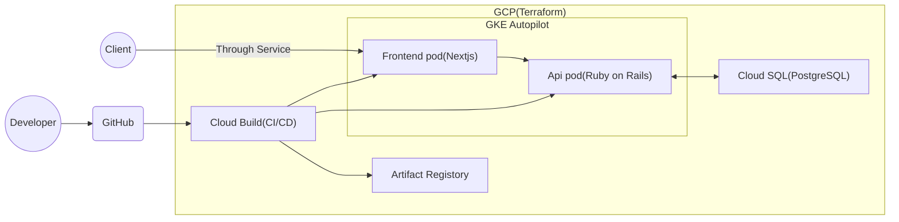

# System architecture

This application the setup of a Next.js frontend and a Ruby on Rails API running on GKE Autopilot.  

It includes a Cloud SQL database, a Cloud Build CI/CD pipeline, and integration with GitHub.   
The entire environment can be provisioned and deployed with a single command.
# Build system on GCP
## Initialize
Create setting files for github.

```bash
cd ~
touch terraform/modules/cloud_build/my-github-token.txt
touch terraform/modules/cloud_build/my-github-app-installation-id.txt
touch terraform/modules/cloud_build/my-github-repo-url.txt
```

### Create and paste gihub access token
1. Go to: [GitHub Tokens](https://github.com/settings/tokens).
1. Create a token using "Token (classic)" (not beta).
1. Paste the access token into ***terraform/modules/cloud_build/my-github-token.txt***


### Check github install ID
1. Go to: [GitHub App Installations](https://github.com/apps/google-cloud-build/installations/select_target).
1. Paste the number at the end of the linked URL into ***terraform/modules/cloud_build/my-github-app-installation-id.txt***


### Check repo URL
Paste the repo URL into ***terraform/modules/cloud_build/my-github-repo-url.txt***  
***Example: https://github.com/matao0214/memo-app.git***


## Create system and deploy application
```bash
cd ~
sh ./script/setup.sh
```


# Deploy from local
Create the infrastructure in advance, including authentication with gke.
```bash
gcloud container clusters get-credentials example-autopilot-cluster --region asia-northeast1 --project matao0214-demo
```

## Frontend
### Push imaga to Artifact Registry
```bash
cd frontend/
docker build -t memo-app-frontend-prod:latest -f Dockerfile.prod .
docker tag memo-app-frontend-prod asia-northeast1-docker.pkg.dev/matao0214-demo/docker/memo-app-frontend:latest
docker push asia-northeast1-docker.pkg.dev/matao0214-demo/docker/memo-app-frontend:latest
```

### Apply for GKE
```bash
cd k8s/
kubectl apply -f ./deployment/frontend.yaml
kubectl apply -f ./service/frontend.yaml
```

## Api
### Push imaga to Artifact Registry
```bash
cd api/
docker build -t memo-app-api-prod:latest -f Dockerfile.prod .      
docker tag memo-app-api-prod:latest asia-northeast1-docker.pkg.dev/matao0214-demo/docker/memo-app-api:latest
docker push asia-northeast1-docker.pkg.dev/matao0214-demo/docker/memo-app-api:latest
```

### Apply for GKE
```bash
cd k8s/
kubectl apply -f ./deployment/api.yaml
kubectl apply -f ./service/api.yaml
```

### Migration database
```bash
kubectl get pod
kubectl exec -it ${pod_name} -- /bin/bash
rails db:create db:migrate RAILS_ENV=production
```

# Terraform
## Vulnerability Check
```bash
cd terraform 

brew install trivy
trivy config ./main.tf 

brew install checkov
checkov --file ./main.tf 
```

## Setting terraform precommit
```bash
brew install pre-commit
pre-commit install
```
Refer to: [Pre-Commit Terraform Introduction](https://dev.classmethod.jp/articles/pre-commit-terraform-introduction/).

# Clean up
```bash
cd ~
sh ./script/cleanup.sh
```

# Application Reference
For further details, refer to: [Application Reference](https://zenn.dev/jinku/articles/92b76bf09d5351).

# Start dev in local
```bash
cd docker/
docker compose up -d
```
URL: http://localhost:3001
