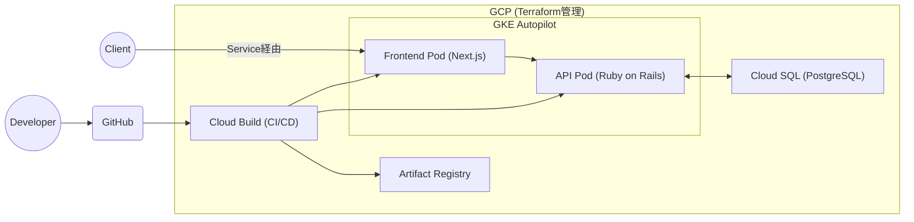

# k8s Memo App

## 概要

GCP・Terraform・Kubernetes・CI/CD を活用した、インフラ自動化 ＆ メモWebアプリ  

**コマンド1つでクラウド環境構築・アプリデプロイが可能**な設計です

クラウド上のWebアプリで何か試したい時、すぐに環境構築できて、不要になったら簡単にクリーンアップできます。

---

## システム構成図



---

## ポイント

- **インフラ自動化**  
  Terraform で GCP リソースをコード管理。  

- **CI/CD パイプライン**  
  GitHub 連携で Cloud Build が自動ビルド＆デプロイ。

- **コマンド1つで環境構築**  
  クラウド環境からアプリまで自動構築。

- **セキュリティ・品質管理**  
  Trivy/Checkov による IaC 脆弱性チェック、pre-commit による静的解析。

---

## クイックスタート

### GCP環境

#### インフラ・アプリ自動構築

初回の場合、[GCP環境構築の事前準備](#gcp環境構築の事前準備)を実施。その後以下コマンド実行。

```bash
make setup-gcp
```
20分程度で[システム構成図](#システム構成図)の環境が構築されます。

ログに出力される`Application URL:`からアプリケーションにアクセス可能。

#### クリーンアップ

```bash
make clean-gcp
```

### ローカル開発環境の構築

docker環境を構築

```bash
make up
```

アクセス: [http://localhost:3001](http://localhost:3001)

---

## 手動でのデプロイ手順

### GKE 認証

```bash
gcloud container clusters get-credentials example-autopilot-cluster --region asia-northeast1 --project matao0214-demo
```

### イメージビルド＆プッシュ

#### Frontend

```bash
cd frontend/
docker build -t memo-app-frontend-prod:latest -f Dockerfile.prod .
docker tag memo-app-frontend-prod asia-northeast1-docker.pkg.dev/matao0214-demo/docker/memo-app-frontend:latest
docker push asia-northeast1-docker.pkg.dev/matao0214-demo/docker/memo-app-frontend:latest
```

#### API

```bash
cd api/
docker build -t memo-app-api-prod:latest -f Dockerfile.prod .
docker tag memo-app-api-prod:latest asia-northeast1-docker.pkg.dev/matao0214-demo/docker/memo-app-api:latest
docker push asia-northeast1-docker.pkg.dev/matao0214-demo/docker/memo-app-api:latest
```

### Kubernetes へデプロイ

```bash
cd k8s/
kubectl apply -f ./deployment/frontend.yaml
kubectl apply -f ./service/frontend.yaml
kubectl apply -f ./deployment/api.yaml
kubectl apply -f ./service/api.yaml
```

### DB マイグレーション

```bash
kubectl get pod
kubectl exec -it ${pod_name} -- /bin/bash
rails db:create db:migrate RAILS_ENV=production
```

---

## IaC セキュリティチェック

```bash
cd terraform

brew install trivy
trivy config ./main.tf

brew install checkov
checkov --file ./main.tf
```

---

## GCP環境構築の事前準備

### 1.初期化

Cloud Buildで使用するGithubの設定ファイルを作成

```bash
cd ~
touch terraform/modules/cloud_build/my-github-token.txt
touch terraform/modules/cloud_build/my-github-app-installation-id.txt
touch terraform/modules/cloud_build/my-github-repo-url.txt
```

### 2.Github access token の作成
1. URL: [GitHub Tokens](https://github.com/settings/tokens).
1. `Token (classic)`からtokenを作成
1. tokenを貼り付け ***terraform/modules/cloud_build/my-github-token.txt***


### 3.Github install ID の確認
1. URL: [GitHub App Installations](https://github.com/apps/google-cloud-build/installations/select_target).
1. アクセス先URLの末尾の数字を貼り付け ***terraform/modules/cloud_build/my-github-app-installation-id.txt***


### 4. Repo URL を確認
Repo URL を貼り付け ***terraform/modules/cloud_build/my-github-repo-url.txt***  
***Example: https://github.com/matao0214/k8s-memo-app.git***

---

## 補足

- 詳細なセットアップ手順は `script/setup.sh` 内に記載しています。
