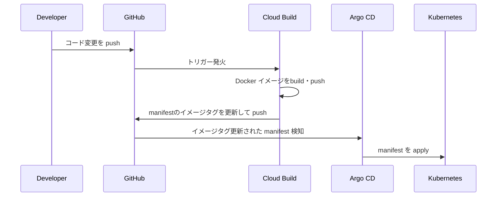

# k8s Memo App

## 概要

GCP・Terraform・Kubernetes・CI/CD を活用した、インフラ自動化 ＆ メモWebアプリ  

コマンド1つでクラウド環境構築・アプリデプロイが可能

---

## システム構成図


---

## CI/CD パイプライン

### アプリケーション



### インフラ
実装予定

---

## 使用技術

| カテゴリ | 使用技術 / ツール |
|----------|----------------|
| 🚀 **インフラ基盤** | GCP (VPC, Cloud SQL, GKE Autopilot), Kubernetes |
| 🛠 **インフラ管理** | Terraform, Terraform Module, Helm, Helmfile |
| 🔄 **CI/CD パイプライン (GitOps)** | GitHub, Cloud Build, Artifact Registry, Argo CD |
| 🛡 **セキュリティ & 品質管理** | Trivy, Checkov, pre-commit hooks |
| 🌐 **アプリケーション** | Next.js, Ruby on Rails, PostgreSQL (Cloud SQL), Docker |

---

## クイックスタート

### GCP環境

#### インフラ・アプリ自動構築

初回の場合、[GCP環境構築の事前準備](#gcp環境構築の事前準備)を実施。その後以下コマンド実行。

```bash
make setup-gcp
```
20分程度で[システム構成図](#システム構成図)の環境が構築されます。

ログに出力される`Application URL:`、`Argocd URL:`からアプリケーションおよびArgoCDへアクセス可能。

#### クリーンアップ

```bash
make clean-gcp
```

### ローカル開発環境

#### 構築

docker環境を構築

```bash
make up
```

アクセス: [http://localhost:3001](http://localhost:3001)

#### DB マイグレーション

```bash
kubectl get pod
kubectl exec -it ${pod_name} -- /bin/bash
rails db:create db:migrate

# 本番環境の場合
rails db:create db:migrate RAILS_ENV=production
```

#### クリーンアップ
```bash
make down
```

---

## IaC セキュリティチェック

```bash
brew install trivy
brew install checkov

cd terraform

trivy config ./main.tf
checkov --file ./main.tf
```

---

## GCP環境構築の事前準備

### 1.初期化

Cloud Buildで使用するGithubの設定ファイルを作成

```bash
cd ~
touch terraform/modules/cloud_build/my-github-token.txt
touch terraform/modules/cloud_build/my-github-app-installation-id.txt
touch terraform/modules/cloud_build/my-github-repo-url.txt
```

### 2.Github access token の作成
1. URL: [GitHub Tokens](https://github.com/settings/tokens).
1. `Token (classic)`からtokenを作成
1. tokenを貼り付け ***terraform/modules/cloud_build/my-github-token.txt***


### 3.Github install ID の確認
1. URL: [GitHub App Installations](https://github.com/apps/google-cloud-build/installations/select_target).
1. アクセス先URLの末尾の数字を貼り付け ***terraform/modules/cloud_build/my-github-app-installation-id.txt***


### 4. Repo URL を確認
Repo URL を貼り付け ***terraform/modules/cloud_build/my-github-repo-url.txt***  
***Example: https://github.com/matao0214/k8s-memo-app.git***

---
