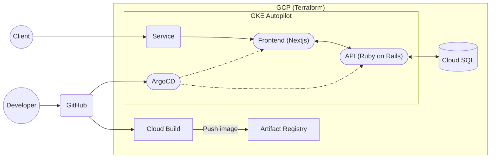
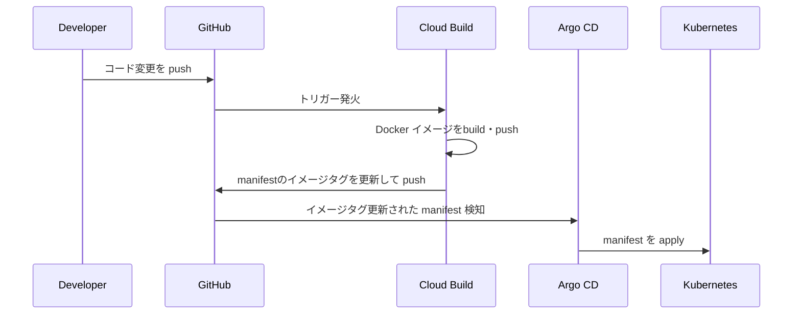

# k8s Memo App

## 概要

GCP・Terraform・Kubernetes・CI/CD を活用した、インフラ自動化 ＆ メモWebアプリ  

コマンド1つでクラウド環境構築・アプリデプロイが可能

---

## システム構成図



---

## CI/CD パイプライン

### アプリケーション



### インフラ
実装予定

---

## 実装ポイント

| カテゴリ | 内容 |
|----------|------|
| 🚀 **インフラ自動化 (IaC)** | - **Terraform** による GCP リソースのコード管理で、**誰でも再現可能な環境構築**を実現<br>- **モジュール化**により、ネットワーク / DB / GKE などを再利用可能にし、保守性を向上<br>- 環境変数を切り替えることで **開発・検証・本番環境を統一した手順でデプロイ可能** |
| 🔄 **CI/CD パイプライン (GitOps)** | - **GitHub** に push すると **Cloud Build** が Docker イメージを自動ビルド<br>- **Artifact Registry** にイメージを格納し、`deployment.yaml` のタグを自動更新<br>- **Argo CD** が変更を検知し、自動的に Kubernetes にデプロイ<br>- CI (ビルド/テスト) と CD (デプロイ) を分離し、**セキュリティ性と拡張性を確保** |
| ⚡ **ワンコマンド環境構築** | - `make up` などの **単一コマンドでクラウド環境からアプリまで構築可能**<br>- 開発者が環境準備に時間を割かず、すぐに開発に集中できる **DX (Developer Experience)** を重視 |
| 🛡 **セキュリティ & 品質管理** | - **Trivy** によるコンテナイメージの脆弱性スキャン<br>- **Checkov** による Terraform コードのセキュリティチェック<br>- **pre-commit hooks** による静的解析・コード整形を自動化し、**品質を担保**<br>- 開発初期から **DevSecOps を意識した設計** |
| 🌐 **モダンな Web アプリケーション** | - **Next.js**: SSR/SSG 対応のモダンフロントエンド<br>- **Ruby on Rails**: API サーバー (業務ロジックを担当)<br>- **PostgreSQL (Cloud SQL)**: スケーラブルで安定した RDBMS<br>- GCP マネージドサービスと統合し、**運用コストを削減しつつ拡張性を確保** |
---

## クイックスタート

### GCP環境

#### インフラ・アプリ自動構築

初回の場合、[GCP環境構築の事前準備](#gcp環境構築の事前準備)を実施。その後以下コマンド実行。

```bash
make setup-gcp
```
20分程度で[システム構成図](#システム構成図)の環境が構築されます。

ログに出力される`Application URL:`、`Argocd URL:`からアプリケーションおよびArgoCDへアクセス可能。

#### クリーンアップ

```bash
make clean-gcp
```

### ローカル開発環境

#### 構築

docker環境を構築

```bash
make up
```

アクセス: [http://localhost:3001](http://localhost:3001)

#### DB マイグレーション

```bash
kubectl get pod
kubectl exec -it ${pod_name} -- /bin/bash
rails db:create db:migrate

# 本番環境の場合
rails db:create db:migrate RAILS_ENV=production
```

#### クリーンアップ
```bash
make down
```

---

## IaC セキュリティチェック

```bash
brew install trivy
brew install checkov

cd terraform

trivy config ./main.tf
checkov --file ./main.tf
```

---

## GCP環境構築の事前準備

### 1.初期化

Cloud Buildで使用するGithubの設定ファイルを作成

```bash
cd ~
touch terraform/modules/cloud_build/my-github-token.txt
touch terraform/modules/cloud_build/my-github-app-installation-id.txt
touch terraform/modules/cloud_build/my-github-repo-url.txt
```

### 2.Github access token の作成
1. URL: [GitHub Tokens](https://github.com/settings/tokens).
1. `Token (classic)`からtokenを作成
1. tokenを貼り付け ***terraform/modules/cloud_build/my-github-token.txt***


### 3.Github install ID の確認
1. URL: [GitHub App Installations](https://github.com/apps/google-cloud-build/installations/select_target).
1. アクセス先URLの末尾の数字を貼り付け ***terraform/modules/cloud_build/my-github-app-installation-id.txt***


### 4. Repo URL を確認
Repo URL を貼り付け ***terraform/modules/cloud_build/my-github-repo-url.txt***  
***Example: https://github.com/matao0214/k8s-memo-app.git***

---
